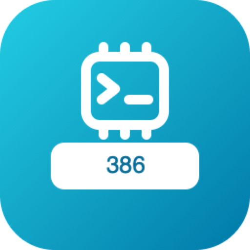

# go-asmgen — brand assets

Official logos for the **go-asmgen** organization.

## Formats

- **SVG** — `svg/color`, `svg/white` (white, transparent), `svg/black` (black, transparent)
- **PNG** 16→1024 px, 3 variants — `png/<variant>/<size>/`
- **JPG** (color, white background) — `jpg/<size>/`
- **ICO** (Windows) — `ico/`
- **ICNS** (macOS) — `icns/`
- **GitHub avatar** 512 px — `avatar/`

## Repos (5)

| | repo |
|---|---|
|  | `386` |
|  | `amd64` |
|  | `arm64` |
|  | `riscv64` |
|  | `wasm` |

---
*Auto-generated assets — rounded square badge, line glyph, color / white / black variants.*
